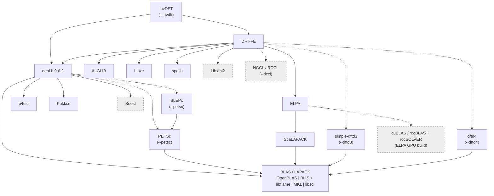

# Installing DFT-FE and invDFT with `install.py`

`install.py` builds [DFT-FE](https://github.com/dftfeDevelopers/dftfe) and,
optionally, invDFT, together with every library they depend on. It follows the
installation chapter of the DFT-FE manual and the machine-specific scripts in
[install_DFTFE](https://github.com/dftfeDevelopers/install_DFTFE) (branches
`frontierDevelop`, `perlmutterDevelop`, `greatlakesDevelop`). All settings for
a machine live in one JSON configuration file. The templates in
[`configs/`](configs) (`cfg_frontier.json`, `cfg_perlmutter.json`,
`cfg_greatlakes.json`, `cfg_generic.json`) each contain the per-machine details
(modules, compilers, GPU flags, tested versions) as an inline **machine
profile**, next to the installation settings.

- [Requirements](#requirements)
- [Dependencies at a glance](#dependencies-at-a-glance)
- [Quick start](#quick-start)
- [What gets built and how](#what-gets-built-and-how)
- [Directory layout](#directory-layout)
- [How a run works](#how-a-run-works)
- [Options](#options)
- [Package names](#package-names)
- [Configuration files](#configuration-files)
- [Machine profiles](#machine-profiles)
- [After installation](#after-installation)
- [Troubleshooting and caveats](#troubleshooting-and-caveats)

## Requirements

- Python 3.6 or newer (standard library only).
- `bash`, `curl`, `tar`, `git`, `make`, and CMake 3.17 or newer. CMake usually
  comes from a module listed in the machine profile.
- C, C++ and Fortran compilers (GNU), an MPI library, and Boost ≥ 1.59, from
  modules or the system. Intel compilers are not supported for deal.II, so use
  the GNU compilers (`PrgEnv-gnu` on Cray machines).
- For GPU builds: the CUDA toolkit (NVIDIA), ROCm (AMD) or oneAPI (Intel).
- Internet access for downloads. If compute nodes have none, use `--fetch-only`
  on a login node first (see [`--fetch-only`](#run-control)).

Build inside an interactive job, not on a login node: compiling deal.II and
DFT-FE needs a lot of memory, and GPU builds should run where the GPU toolchain
is available. The installer warns when it does not detect a Slurm allocation.

## Dependencies at a glance

### What the dependencies are for

DFT-FE is a real-space finite-element code for Kohn-Sham DFT. Its dependencies
fall into four groups:

- **Finite-element infrastructure.** [deal.II](https://www.dealii.org) supplies
  the meshes, finite-element spaces, parallel vectors and matrix-free operators
  that DFT-FE is built on. deal.II in turn uses **p4est** to distribute adaptive
  octree meshes over MPI ranks, **Kokkos** for its performance-portable kernels,
  and **Boost**.
- **Dense linear algebra.** The Chebyshev-filtered subspace iteration in DFT-FE
  ends each step with dense subspace problems: projection, orthonormalization and
  the Rayleigh-Ritz eigenproblem. These run on **BLAS/LAPACK** on each rank, and
  in parallel through **ELPA**, which is built on **ScaLAPACK** and can use GPUs.
- **Physics and input.** **Libxc** provides the exchange-correlation functionals,
  **spglib** finds crystal symmetries to reduce k-points, **ALGLIB** fits splines
  to radial data (pseudopotentials, atomic densities), and **Libxml2** reads XML
  input such as pseudopotential files.
- **Optional extras.** **PETSc/SLEPc** for the Gram-Schmidt orthogonalization of
  all-electron calculations; **simple-dftd3** and **dftd4** for Grimme dispersion
  corrections; **NCCL/RCCL** for fast GPU collective communication in very large
  runs.

invDFT is built on top of DFT-FE: it links to DFT-FE's real-arithmetic library and
reuses DFT-FE's finite-element and solver infrastructure.

### How they link

An arrow means "links against". Dashed arrows are optional or depend on the
build (GPU, PETSc, dispersion corrections). Grey boxes come from the machine
(modules or system) and are not built by the installer. Not drawn: everything
also uses the compilers and MPI, and every GPU build uses the CUDA/HIP/SYCL
runtime.



The installer builds from the bottom up: BLAS/LAPACK, then the independent
libraries (ALGLIB, Libxc, spglib, p4est, Kokkos), then ScaLAPACK and ELPA,
PETSc/SLEPc, deal.II, the dispersion libraries, DFT-FE and finally invDFT.
With `--petsc`, deal.II is built twice, once against real and once against
complex PETSc/SLEPc. DFT-FE's real executable uses the first and its complex
(k-point) executable the second. MKL and libsci come from modules, and libsci
also supplies ScaLAPACK. OpenBLAS and BLIS + libflame are built from source.

### What changes from machine to machine

The package list, the build order and most configure options are the same
everywhere. Only these things depend on the machine, and they are exactly what a
[machine profile](#machine-profiles) records:

- **Programming environment and compilers.** On Cray machines (Frontier,
  Perlmutter) one set of wrappers, `cc`/`CC`/`ftn`, compiles everything and adds
  MPI automatically. On Great Lakes, packages without MPI use
  `gcc`/`g++`/`gfortran` and MPI packages use `mpicc`/`mpicxx`/`mpif90`. A
  ScaLAPACK build therefore runs `-DCMAKE_C_COMPILER=cc` on Frontier but
  `-DCMAKE_C_COMPILER=mpicc` on Great Lakes.
- **Modules.** The same software has different module names and versions at each
  site, and they change with system updates. Frontier loads
  `cpe/25.09 PrgEnv-gnu gcc-native cmake boost` (+ `rocm` for GPUs), Perlmutter
  `PrgEnv-gnu gcc-native cray-mpich cmake` (+ `cudatoolkit`), and Great Lakes
  `gcc/13.2.0 openmpi/5.0.3 cmake/3.26.3 boost/1.78.0`.
- **CPU tuning.** Compiler flags target the processor: `-march=znver3` for the
  AMD EPYC CPUs of Frontier and Perlmutter, `-march=native` on Great Lakes.
  ELPA's hand-written SIMD kernels also differ: Perlmutter disables all of them
  (SSE through AVX-512), Frontier only AVX-512, Great Lakes none.
- **BLAS/LAPACK.** The fastest library depends on the CPU and what the site
  provides: BLIS + libflame on AMD CPUs, MKL on Intel CPUs (`--blas mkl` on
  Great Lakes), libsci on Cray, OpenBLAS as a portable default. Their link lines
  differ too. MKL needs separate C and Fortran interface libraries
  (`mkl_intel_lp64` vs `mkl_gf_lp64`).
- **GPU.** Vendor and language (CUDA on Perlmutter, HIP on Frontier, SYCL on
  Intel), architecture (`sm_80` for A100, `gfx90a` for MI250X, `pvc`), and how
  ELPA's GPU kernels are built. On Frontier ELPA is compiled with `hipcc`
  against rocBLAS/rocSOLVER; on Perlmutter with the Cray wrappers plus
  `-target-accel=nvidia80`.
- **MPI and link details.** On Frontier DFT-FE must also link the Cray GTL
  library (`$PE_MPICH_GTL_LIBS_amd_gfx90a`) so that MPICH can send GPU buffers,
  plus `-lamdhip64`. Perlmutter and Great Lakes need nothing extra. NCCL comes
  from `$NCCL_DIR` (the `nccl` module) on Perlmutter; RCCL comes with ROCm
  (`$ROCM_PATH`) on Frontier.
- **Runtime environment.** What `env.sh` must set before running: the same
  modules, `MPICH_GPU_SUPPORT_ENABLED=1` for GPU runs on Cray machines, and
  `$CRAY_LD_LIBRARY_PATH` on `LD_LIBRARY_PATH` so Cray libraries are found at
  run time.

See [What differs between machines](#what-differs-between-machines) for the
concrete values on Frontier, Perlmutter and Great Lakes.

## Quick start

```bash
cd invDFT/install

# Each machine has a template, configs/cfg_<machine>.json, holding its machine
# profile and default settings (DFT-FE + invDFT). The templates have "prefix": null,
# so give the location on the command line (or set it in your copy of the file).

# OLCF Frontier, AMD GPUs, DFT-FE + invDFT (PETSc/SLEPc and 32-bit integers follow)
python3 install.py --config configs/cfg_frontier.json --prefix /lustre/orion/<projid>/scratch/$USER/dftfe

# NERSC Perlmutter, NVIDIA GPUs, DFT-FE only, with NCCL and dftd4
python3 install.py --config configs/cfg_perlmutter.json --prefix $PSCRATCH/dftfe --no-invdft --dccl --dftd4

# UMich Great Lakes, CPU only, MKL, dependencies in a separate (shared) prefix
python3 install.py --config configs/cfg_greatlakes.json --prefix $HOME/dftfe \
    --prefix-dependencies /scratch/<account>_root/<account>/$USER/dftfe-deps --blas mkl

# Great Lakes A100 partition
python3 install.py --config configs/cfg_greatlakes.json --prefix $HOME/dftfe-gpu \
    --gpu --gpu-vendor nvidia --gpu-arch 80

# Any other cluster: copy the generic template, list your modules in its "machine" entry, then
cp configs/cfg_generic.json ~/dftfe_mycluster.json
python3 install.py --config ~/dftfe_mycluster.json --prefix $HOME/dftfe

# Answer questions instead (also what happens with no arguments); the answers,
# including the machine profile, are saved as a config file for reruns
python3 install.py --interactive
```

Without `--config`, the installer picks the template whose detection rules match
the host (Frontier, Perlmutter or Great Lakes, otherwise `generic`) and uses its
machine profile with the built-in default settings. In that case invDFT is not
built unless you pass `--invdft`.

Before a real build, add `--dry-run` to any command. It prints the plan and
every command without changing anything.

## What gets built and how

### How the installer works

A few principles shape every run:

- **One script, machine data in profiles.** The build logic (which packages,
  in what order, with which options) lives in `install.py`. Everything
  machine-specific (modules, compilers, flags) lives in a
  [machine profile](#machine-profiles), the `"machine"` entry of a configuration
  file such as `configs/cfg_frontier.json`. Supporting a new machine means
  writing a profile, not changing the script.
- **Everything is a visible shell command.** Each step is a plain `bash` snippet
  (download, configure, build, install), run inside the module environment that
  `env.sh` also sets up. `--dry-run` prints them all, `--emit-script` saves them
  as a script, and every command and its output go to a per-package log. See
  [Run control](#run-control).
- **Dependencies are built from source into one prefix.** Apart from the
  toolchain (compilers, MPI, CMake, Boost, GPU toolkit, optionally MKL/libsci),
  all dependencies are downloaded and built with the same compilers, MPI and
  BLAS/LAPACK, as the DFT-FE manual strongly recommends. They are installed into
  `--prefix-dependencies`, which can be shared between several DFT-FE builds.
  See [Directory layout](#directory-layout).
- **DFT-FE and invDFT are working checkouts.** They are cloned under `--prefix`
  and built inside their own source trees, like `setupUser.sh` does. You can
  edit, `git pull` and rebuild them (`--only dftfe,invdft`), and the installer
  never deletes them.
- **Reruns resume; changes rebuild only what they affect.** Each installed
  package records a signature of its version and build commands. A rerun skips
  what is up to date and rebuilds what changed, plus everything that depends on
  it. See [How a run works](#how-a-run-works).
- **Only the results are kept.** Once everything succeeds, dependency sources,
  build trees and logs are deleted. On failure everything is kept for debugging
  and resuming. See [Cleanup](#cleanup).
- **Every default can be overridden.** Built-in defaults < machine profile <
  config file < command line, with escape hatches for single packages
  (`--pkg-version`, `--extra-args`, `--use-existing`). See [Options](#options)
  and [Configuration files](#configuration-files).

### Packages

Packages are built in this order; each one only after those it depends on. The
categories are those of [What the dependencies are for](#what-the-dependencies-are-for),
plus *Application* for DFT-FE and invDFT themselves.

| Package | Category | Default version | Built when | Notes |
|---|---|---|---|---|
| OpenBLAS | Dense linear algebra | 0.3.28 | `--blas openblas` | Optimized BLAS and full LAPACK in one library, used by every package that does dense linear algebra. Portable default; built serial (`USE_THREAD=0`, no OpenMP) because DFT-FE normally runs one MPI rank per core or GPU. |
| BLIS + libflame | Dense linear algebra | 3.0.1 + 5.2.0 | `--blas blis+flame` | AMD's BLIS (BLAS tuned for EPYC/Zen) plus libflame, which provides the LAPACK interface on top of BLIS (`--enable-lapack2flame`). Default on Frontier and Perlmutter. |
| ALGLIB | Physics and input | 4.06.0 | always | Numerical library; DFT-FE uses its spline fitting for radial data such as pseudopotential projectors and atomic densities. Compiled as `libAlglib.so`, installed with its headers in `<deps>/alglib`. |
| Libxc | Physics and input | 6.2.2 (Frontier: 7.0.0) | always | Library of exchange-correlation functionals (LDA, GGA, meta-GGA, hybrids). DFT-FE evaluates the XC energy and potential through it. |
| spglib | Physics and input | commit `02159ee` | always | Finds the space-group symmetries of a crystal structure. DFT-FE uses them to reduce the k-point set in periodic calculations. |
| p4est | Finite-element infrastructure | 2.8.7 (Great Lakes: 2.8.6) | always | Parallel adaptive octree meshes. deal.II uses it to refine the finite-element mesh and distribute it over MPI ranks. Optimized (FAST) and debug (DEBUG) builds go in `<deps>/p4est`, as deal.II expects; must be built with zlib. |
| Kokkos | Finite-element infrastructure | 4.3.00 (Frontier: 4.6.00) | always | Performance-portability layer required by deal.II 9.6. Built for CPUs only: DFT-FE has its own GPU kernels and the manual says not to build deal.II with GPU support. |
| ScaLAPACK | Dense linear algebra | 2.2.2 | unless `--blas libsci` | Distributed-memory dense linear algebra over a 2D process grid; the foundation ELPA needs. Netlib reference version linked to the chosen BLAS/LAPACK. libsci already contains ScaLAPACK. |
| ELPA | Dense linear algebra | 2025.01.001 (Frontier: 2026.02.001) | always | Scalable distributed dense eigensolver. DFT-FE uses it for the dense subspace problems of each SCF step (Rayleigh-Ritz eigenproblem, Cholesky-based orthonormalization). Required by DFT-FE; with `--gpu` its kernels run on NVIDIA or AMD GPUs. |
| PETSc, SLEPc | Optional extras | 3.21.1 | `--petsc` (default with `--invdft`) | Sparse linear algebra (PETSc) and eigensolvers (SLEPc). DFT-FE uses them through deal.II for the more robust Gram-Schmidt orthogonalization of all-electron calculations. Real and complex variants, 64-bit indices. |
| deal.II | Finite-element infrastructure | **9.6.2** | always | The finite-element library DFT-FE is built on: meshes, finite-element spaces, quadrature, parallel vectors, matrix-free operators. Configured with MPI, p4est, Kokkos, LAPACK, 64-bit indices and an external Boost. One build, or real + complex builds with PETSc. |
| simple-dftd3 | Optional extras | 0.6.0 | `--dftd3` | Grimme's DFT-D3 dispersion correction for energy, forces and stress. Own prefix `<deps>/dftd3`, since it and dftd4 each bundle their own copy of the shared library mctc-lib. |
| dftd4 | Optional extras | 3.7.0 | `--dftd4` | Grimme's DFT-D4 dispersion correction for energy, forces and stress. Own prefix `<deps>/dftd4`. |
| DFT-FE | Application | branch `publicGithubDevelop` | always (unless skipped) | The finite-element Kohn-Sham DFT code. Real executable (molecules and Gamma-point periodic runs) and complex executable (k-point sampling), built in its checkout. |
| invDFT | Application | branch `invGKS` | `--invdft` | Inverse DFT: finds the exchange-correlation potential that reproduces a given density. Real executable, linked to DFT-FE's real library in the DFT-FE build tree. |

Not built by the installer: compilers, MPI, CMake, Boost, Libxml2, CUDA/ROCm/oneAPI
and NCCL/RCCL. They come from modules or the system. Use `--use-existing` to point
at specific installations of Boost, Libxml2 or NCCL/RCCL.

Change any version with `--pkg-version PKG=VER` (e.g. `--pkg-version dealii=9.7.1`).
The DFT-FE manual asks for deal.II 9.6.2, which is therefore the default on every machine.

## Directory layout

```
<prefix-dependencies>/          (= <prefix> unless --prefix-dependencies is given)
  lib/ include/ bin/            OpenBLAS or BLIS/libflame, Libxc, spglib, Kokkos, ScaLAPACK, ELPA
  alglib/  p4est/{FAST,DEBUG}/  dealii/ or dealii-real/ + dealii-complex/
  petsc-real/ petsc-complex/ slepc-real/ slepc-complex/  dftd3/ dftd4/
  src/ build/ logs/             sources, build trees, logs   (deleted after success by default)
  .install_dftfe/stamps/        one JSON file per installed dependency

<prefix>/
  env.sh                        modules + library paths; source it before running
  install_dftfe_config.json     the resolved settings of the last run (usable with --config)
  dftfe/                        DFT-FE git checkout (or --dftfe-src)
    build/release/real/dftfe
    build/release/complex/dftfe
    build/install_dftfe.log
  invDFT/                       invDFT git checkout (or --invdft-src)
    build/release/real/invDFT_exe
    build/install_invdft.log
  .install_dftfe/stamps/        stamps for DFT-FE and invDFT
```

DFT-FE and invDFT are built inside their own checkouts and are never deleted by
the installer. invDFT links directly against `dftfe/build/<type>/real`. Its
include path is `dftfe/include` plus the DFT-FE build's `include/`, because newer
DFT-FE generates `config.h` in its build tree.

## How a run works

1. **Settings are resolved.** Later sources win:
   built-in defaults → the machine profile's `defaults` → `--config` file → command line.
   Some defaults depend on other settings:

   | Setting | Default |
   |---|---|
   | `elpa_gpu` | on if `--gpu`, except for Intel GPUs |
   | `int64` | off (32-bit integers) with `--invdft`, on otherwise; `--int64` with `--invdft` is an error |
   | `petsc` | on if `--invdft` |
   | `dftfe_branch` | `publicGithubDevelop` (also with `--invdft`) |
   | `prefix_dependencies` | `--prefix` |
   | `jobs` | min(number of CPUs, 16) |

2. **The environment is set up.** The installer writes the module loads and
   library paths that `env.sh` will contain, sources them once in `bash`, and
   uses the resulting environment for every build step. Modules that fail to
   load stop a real run, and are reported as a note in a dry run.

3. **A plan is made.** For each package the installer computes a *signature* from
   its version, the exact commands it would run, and the signatures of its
   dependencies. The package is then:
   - `build (not installed)`: no stamp yet;
   - `build (configuration changed)`: the stamp's signature differs (new version,
     different flags, a rebuilt dependency, ...);
   - `done (up to date)`: already installed with the same signature, so skipped;
   - `existing` / `skip` / `keep`: from `--use-existing`, `--skip` or `--only`.

   So a rerun **resumes** after a failure, and changing a setting rebuilds exactly
   the affected packages and everything that depends on them. Changing `--jobs`
   does not trigger rebuilds.

4. **Packages are built.** Each package is downloaded into `<deps>/src` and built
   from scratch in `<deps>/build`. Its output goes to its log. On failure, the end
   of the log is printed and everything is kept for the next run.

5. **Cleanup.** After the whole run succeeds, `<deps>/src`, `<deps>/build` and
   `<deps>/logs` are deleted (see [Cleanup](#cleanup)).

## Options

Every option can also be set in a [configuration file](#configuration-files).
Boolean options come in pairs (`--gpu` / `--no-gpu`) so that the command line can
override a config file in both directions.

### Configuration and location

| Option | Description |
|---|---|
| `--config FILE` | The configuration file: settings plus the machine profile in its `"machine"` entry, e.g. one of the templates `configs/cfg_<machine>.json`. The machine is chosen only here; there is no separate command-line option for it. Without `--config`, the template whose detection rules match the host is used for the machine profile (otherwise `generic`). See [Configuration files](#configuration-files). |
| `--prefix DIR` | **Required** (here or as `"prefix"` in the config file). Where DFT-FE and invDFT are checked out and built, and where `env.sh` is written. |
| `--prefix-dependencies DIR` | Separate install prefix for all dependencies, i.e. everything except DFT-FE and invDFT. Defaults to `--prefix`. `--prefix_dependencies` is accepted too. Useful for sharing one set of dependencies between several DFT-FE builds. |
| `--jobs N`, `-j N` | Parallel build jobs. Default min(#CPUs, 16). deal.II needs roughly 2 GB of memory per job. |
| `--interactive` | Ask for the main settings, starting with the machine (a template name or a profile/config path). Then offer to save the answers, with the machine profile written inline, as a config file for reruns (default `cfg_<machine>_mine.json`). Also used when the script is run with no arguments. |
| `--yes`, `-y` | Do not ask "Proceed?" before building. No prompt is shown when stdin is not a terminal, e.g. in a batch job. |

### Features

| Option | Default | Description |
|---|---|---|
| `--gpu` / `--no-gpu` | from profile | GPU support in DFT-FE (and invDFT). Defaults: on for Frontier and Perlmutter, off otherwise. |
| `--gpu-vendor {nvidia,amd,intel}` | from profile | Selects CUDA, HIP or SYCL. |
| `--gpu-arch ARCH` | from profile | NVIDIA compute capability (`80`, `sm_80`, `90`), AMD target (`gfx90a`, `gfx942`) or Intel device (`pvc`, the default for Intel). Required for GPU builds when the profile has no default. |
| `--elpa-gpu` / `--no-elpa-gpu` | on with `--gpu` | Build ELPA with GPU kernels. ELPA itself is always built because DFT-FE requires it; this only controls its GPU support. Always CPU-only for Intel GPUs. |
| `--blas {openblas,blis+flame,mkl,libsci}` | from profile | BLAS/LAPACK used by every package. `openblas` and `blis+flame` are **built from source**. `mkl` and `libsci` cannot be built and come from modules (`libsci` needs a Cray profile). Defaults: `blis+flame` on Frontier and Perlmutter, `openblas` elsewhere. |
| `--petsc` / `--no-petsc` | on with `--invdft` | Build PETSc and SLEPc (real and complex) and link deal.II to them, giving `dealii-real` and `dealii-complex`. Needed for all-electron calculations with Gram-Schmidt orthogonalization. |
| `--dftd3` / `--no-dftd3` | off | Build simple-dftd3 for DFT-D3 dispersion corrections. |
| `--dftd4` / `--no-dftd4` | off | Build dftd4 for DFT-D4 dispersion corrections. |
| `--dccl` / `--no-dccl` | off | Link NCCL (CUDA) or RCCL (HIP) for GPU collectives. Recommended for very large systems (more than 20,000 electrons) on machines with GPU-direct MPI. The library location comes from the profile (`$NCCL_DIR` on Perlmutter, `$ROCM_PATH` for AMD), otherwise from `--use-existing dccl=PATH`. |
| `--gpu-aware-mpi` / `--no-gpu-aware-mpi` | off | `WITH_GPU_AWARE_MPI=ON`. Only use it if the MPI library is GPU-aware and has been profiled to be fast. |
| `--int64` / `--no-int64` | on; off with `--invdft` | `USE_64BIT_INT` in DFT-FE, for CPU and GPU builds. Avoids integer overflow for large systems; the DFT-FE manual strongly recommends it for GPU runs. GPU builds need CUDA ≥ 12.0 or ROCm ≥ 6.3; use `--no-int64` with older toolkits. **invDFT does not support 64-bit integers yet**, so with `--invdft` DFT-FE is built with 32-bit integers, and passing `--int64` (or `"int64": true` in a config file) stops with an error. |
| `--higher-quad-psp` / `--no-higher-quad-psp` | off | `HIGHERQUAD_PSP=ON`: higher-order quadrature for pseudopotential data, recommended for MD with hard pseudopotentials. |
| `--real-only` | off | Build only the real DFT-FE executable. The complex one is needed for k-points. |
| `--build-type {Release,Debug}` | `Release` | Build type of DFT-FE and invDFT. The output goes to `build/release` or `build/debug`. |

### DFT-FE and invDFT sources

| Option | Default | Description |
|---|---|---|
| `--dftfe-repo` | `github` | `github` (github.com/dftfeDevelopers/dftfe), `bitbucket` (bitbucket.org/dftfedevelopers/dftfe) or any git URL. |
| `--dftfe-branch` | `publicGithubDevelop` | DFT-FE branch to check out, with or without `--invdft`. |
| `--dftfe-src DIR` | `<prefix>/dftfe` | Location of the DFT-FE checkout. An existing directory is used as it is. |
| `--invdft` / `--no-invdft` | off | Also build invDFT. Turns on PETSc/SLEPc and 32-bit integers by default. `--no-invdft` overrides `"invdft": true` from a config file (e.g. the templates in `configs/`). |
| `--invdft-repo URL` | github.com/dftfeDevelopers/invDFT | invDFT repository. |
| `--invdft-branch` | `invGKS` | invDFT branch. |
| `--invdft-src DIR` | `<prefix>/invDFT` | Location of the invDFT checkout, e.g. an existing clone. |
| `--git-pull` | off | For existing checkouts: `git fetch`, check out the requested branch, `git pull --ff-only`. Without it, existing checkouts are not touched. A warning is printed if a checkout is on a different branch. |

A missing checkout is cloned with `git clone -b <branch>`.

### Toolchain overrides

These change what the machine profile provides, for one run. To change them
permanently, edit or extend the profile instead.

| Option | Description |
|---|---|
| `--modules "A B C"` | Replace the profile's whole module list, including its CPU/GPU/BLAS modules. |
| `--add-module M` | Load one more module after the profile's modules (repeatable). Example: `--add-module mkl` with `--blas mkl` on a machine whose profile has no MKL module. |
| `--cc`, `--cxx`, `--fc` | Serial C, C++ and Fortran compilers. Used for OpenBLAS, BLIS, libflame, ALGLIB, Libxc, spglib, dftd3/dftd4, and as deal.II's `CMAKE_*_COMPILER`. |
| `--mpicc`, `--mpicxx`, `--mpifc` | MPI compiler wrappers. Used for p4est, Kokkos, ScaLAPACK, ELPA (CPU builds), PETSc, deal.II's `MPI_*_COMPILER`, DFT-FE and invDFT. On Cray profiles all six are `cc`/`CC`/`ftn`. |
| `--cpu-arch-flags "-march=..."` | CPU architecture flags (default from the profile: `-march=znver3` on Frontier/Perlmutter, `-march=native` otherwise). Pass `""` to drop them. |
| `--device-flags "..."` | `CMAKE_CUDA_FLAGS` / `CMAKE_HIP_FLAGS` / `CMAKE_SYCL_FLAGS` for DFT-FE and invDFT. |
| `--cxx-flags "..."` | `CMAKE_CXX_FLAGS` for DFT-FE and invDFT. |
| `--pkg-version PKG=VER` | Override a dependency version (repeatable). Names: `openblas blis libflame alglib libxc spglib p4est kokkos scalapack elpa petsc slepc dealii dftd3 dftd4`. For spglib the value is a git commit. |
| `--extra-args PKG=ARGS` | Extra arguments appended to a package's configure/cmake/make command (repeatable), e.g. `--extra-args elpa="--enable-openmp"` or `--extra-args dftfe="-DWITH_TESTING=ON"`. `petsc`, `slepc` and `dealii` apply to all their variants. |

### Run control

| Option | Description |
|---|---|
| `--only PKG[,PKG]` | Build **only** these packages, and always rebuild them. Their dependencies must already be installed (by an earlier run or `--use-existing`), otherwise the run stops and lists what is missing. All other packages are left alone. DFT-FE and invDFT are rebuilt incrementally, so `--only dftfe,invdft` is the way to recompile after updating their sources. Repeatable, or comma-separated. |
| `--skip PKG` | Leave a package out of the run. Packages that depend on it look for it at its usual location. Example: `--skip dftfe` builds only the dependencies. Repeatable, or comma-separated. |
| `--force PKG\|all` | Rebuild a package even though it is installed with the same configuration. Dependencies are rebuilt from scratch; DFT-FE and invDFT incrementally. Packages that depend on a forced one are **not** rebuilt automatically; the installer prints a note naming them. |
| `--use-existing PKG=PATH` | Use an existing installation instead of building one. PATH is the install prefix (for deal.II, the directory given to `DEAL_II_DIR`; for p4est, the directory containing `FAST/` and `DEBUG/`; for ALGLIB, the directory containing `libAlglib.so` and the headers). Also accepts `boost=PATH` (passed as `BOOST_DIR`), `libxml2=PREFIX`, `dccl=PREFIX` (NCCL/RCCL) and `dftfe=CHECKOUT` (an already built DFT-FE checkout, for building only invDFT). Exact package names only, e.g. `dealii-real`. Repeatable. |
| `--dry-run` | Show the resolved settings, the plan, `env.sh` and every command, then exit without changing anything. |
| `--emit-script FILE` | Same as `--dry-run`, but write the commands to an executable bash script that you can read, edit or run yourself, e.g. from a batch job. |
| `--fetch-only` | Only download sources and clone the repositories. Use it on a login node when compute nodes have no internet access, then rerun the same command without `--fetch-only` on a compute node. Nothing is deleted after a fetch-only run. |
| `--verbose`, `-v` | Also show build output on the terminal. It always goes to the log files. |

### Cleanup

After a fully successful run (not after a failure, `--dry-run`, `--emit-script`
or `--fetch-only`), the dependency sources, build trees and logs are deleted:

| Option | Keeps |
|---|---|
| `--keep-src-dep` | `<deps>/src` |
| `--keep-build-dep` | `<deps>/build` |
| `--keep-logs-dep` | `<deps>/logs` |

The installed dependencies, their stamps, and the DFT-FE and invDFT checkouts and
build directories are never deleted. As a safety measure, the installer only
deletes `src/`, `build/` and `logs/` directories that it created itself (marked
with a `.install_dftfe_owned` file). It never deletes a directory that contains
the DFT-FE or invDFT checkout.

## Package names

Names used by `--only`, `--skip`, `--force`, `--use-existing` and `--extra-args`:

```
openblas | blis libflame        (depending on --blas)
alglib libxc spglib p4est kokkos scalapack elpa
petsc-real petsc-complex slepc-real slepc-complex dealii-real dealii-complex   (with --petsc)
dealii                                                                           (without --petsc)
dftd3 dftd4 dftfe invdft
```

`petsc`, `slepc` and `dealii` select all of their variants, except in
`--use-existing`, which needs the exact name. Naming a package that is not part
of the current build (e.g. `openblas` with `--blas mkl`) is an error.

## Configuration files

A configuration file is a JSON object whose keys are the option names with `_`
instead of `-`. Command-line options override it. Keys starting with `_` are
ignored, so you can use them for comments. Unknown keys are an error.

```json
{
  "_comment": "DFT-FE + invDFT on Frontier",
  "machine": "frontier",
  "prefix": "/lustre/orion/abc123/scratch/me/dftfe",
  "prefix_dependencies": "/lustre/orion/abc123/proj-shared/dftfe-deps",
  "invdft": true,
  "dftd4": true,
  "jobs": 32,
  "versions": {"elpa": "2025.01.001"},
  "extra_args": {"dftfe": "-DWITH_TESTING=ON"},
  "use_existing": {"boost": "/sw/frontier/boost/1.85"},
  "keep_logs_dep": true
}
```

Keys whose names differ from the option or whose values have a different form:

| Option | Config key | Value |
|---|---|---|
| `--pkg-version PKG=VER` | `versions` | object `{"PKG": "VER"}` |
| `--extra-args PKG=ARGS` | `extra_args` | object `{"PKG": "ARGS"}` |
| `--use-existing PKG=PATH` | `use_existing` | object `{"PKG": "PATH"}` |
| `--add-module M` | `add_module` | list of module names |
| `--modules "A B"` | `modules` | list or space-separated string |
| `--only`, `--skip`, `--force` | `only`, `skip`, `force` | list of package names |
| `--gpu` / `--no-gpu` (and other pairs) | `gpu`, ... | `true` / `false` |

Every real run saves its resolved settings to `<prefix>/install_dftfe_config.json`,
so `--config <prefix>/install_dftfe_config.json` repeats it. One-off settings
(`only`, `force`, `dry_run`, `emit_script`, `fetch_only`, `yes`, `verbose`) are
not saved.

Paths (`prefix`, `prefix_dependencies`, `dftfe_src`, `invdft_src`) may use
environment variables such as `$USER`, `$HOME` or `$PSCRATCH`. The installer
stops if a variable is not set, or if a path still contains a `<...>`
placeholder copied from an example.

### Example configuration files

[`configs/`](configs) contains one template per machine. Each is a complete,
self-contained configuration: its `"machine"` entry is the full
[machine profile](#machine-profiles) for that machine, followed by the
installation settings.

| File | Built-in name | GPU (profile default) | BLAS (profile default) |
|---|---|---|---|
| [`configs/cfg_frontier.json`](configs/cfg_frontier.json) | `frontier` | AMD `gfx90a` | `blis+flame` |
| [`configs/cfg_perlmutter.json`](configs/cfg_perlmutter.json) | `perlmutter` | NVIDIA `80` | `blis+flame` |
| [`configs/cfg_greatlakes.json`](configs/cfg_greatlakes.json) | `greatlakes` | off | `openblas` |
| [`configs/cfg_generic.json`](configs/cfg_generic.json) | `generic` | off | `openblas` |

These templates are also where the built-in machine names come from: in another
configuration file, `"machine": "frontier"` or `"base": "frontier"` means "the
profile inside `configs/cfg_frontier.json`". Editing the profile in a template
therefore changes it for every configuration that refers to it by name. Copying
a template gives you a private copy of both the settings and the profile.

GPU and BLAS defaults live in the profile's `defaults`, so that any
configuration using a profile (inline, by name, or by auto-detection) gets the
machine's GPU setup. To change them for one installation, add the key at the top
level of your copy (e.g. `"gpu": false`, `"blas": "mkl"`), or pass `--no-gpu` /
`--blas mkl`. Top-level settings override the profile's defaults.

**The templates contain no install locations.** `prefix` and
`prefix_dependencies` are `null`, because where to install depends on your
project, account and file system. You must supply the prefix, either in your copy
of the file or on the command line with `--prefix` (and optionally
`--prefix-dependencies`). Without one the installer stops before doing anything.
Typical choices are a project scratch directory on Frontier
(`/lustre/orion/<projid>/scratch/$USER/...`), `$PSCRATCH/...` on Perlmutter,
and `/scratch/<account>_root/<account>/$USER/...` on Great Lakes.

All four build DFT-FE (`publicGithubDevelop`) together with invDFT (`invGKS`),
since they live in the invDFT repository. They leave `int64`, `petsc` and
`elpa_gpu` unset, so these follow from `invdft` and `gpu` (with invDFT: 32-bit
integers and PETSc/SLEPc). Set `"invdft": false` in the file, or pass
`--no-invdft`, to install DFT-FE alone. Each file starts with an `_about` block
explaining how to adapt it, and has `_<key>` comments next to the less obvious
settings.

To use one, copy it outside the repository (or keep a personal copy), set the
prefix, adjust the settings, and check the result with `--dry-run`:

```bash
cp configs/cfg_greatlakes.json ~/dftfe_greatlakes.json
# edit ~/dftfe_greatlakes.json: set "prefix", choose blas, gpu, dftd3/dftd4, ...
python3 install.py --config ~/dftfe_greatlakes.json --dry-run
python3 install.py --config ~/dftfe_greatlakes.json

# or leave the template untouched and give the locations on the command line
python3 install.py --config configs/cfg_perlmutter.json --prefix $PSCRATCH/dftfe \
    --prefix-dependencies /global/cfs/cdirs/<project>/dftfe-deps --dry-run
```

### The machine in a configuration file

`"machine"` can take these forms:

**1. A complete inline profile.** This is what the templates use, so everything
about a machine is in one file. Keys you leave out take the
[defaults](#profile-keys) (GNU compilers, `-march=native`, no modules):

```json
{
  "machine": {
    "description": "Group workstation",
    "march": "-march=skylake-avx512",
    "modules": ["gcc/13", "openmpi/5", "cmake", "boost"],
    "gpu_modules": {"nvidia": ["cuda/12.4"]},
    "defaults": {"gpu": true, "gpu_vendor": "nvidia", "gpu_arch": "86"}
  },
  "prefix": "/home/me/dftfe"
}
```

**2. A reference to a profile kept elsewhere.** It can be a built-in name, or a
path to an external file. The file can be a plain profile (a JSON object with
[profile keys](#profile-keys)) or another configuration file, whose `"machine"`
entry is used. Relative paths are resolved from the referring file. This is
useful when one machine description is shared by several configurations, e.g.
a group-wide profile next to personal config files:

```json
{ "machine": "frontier", "prefix": "/lustre/.../dftfe" }
{ "machine": "../profiles/group_cluster.json", "prefix": "/scratch/me/dftfe" }
{ "machine": "/sw/shared/dftfe/cfg_frontier.json", "prefix": "/lustre/.../dftfe" }
```

**3. A base profile plus overrides.** This adapts a profile kept elsewhere
without copying it. `base` takes a built-in name or a path, as in form 2. Only
the keys you give change; nested objects are merged key by key, and lists are
replaced:

```json
{
  "machine": {
    "base": "frontier",
    "modules": ["cpe/25.12", "PrgEnv-gnu", "gcc-native", "cmake", "boost"],
    "gpu": {"amd": {"elpa": {"fcflags": "-march=znver3 -O3 -fPIC"}}}
  },
  "prefix": "/lustre/.../dftfe",
  "invdft": true
}
```

## Machine profiles

A machine profile describes how to build on one machine: modules, compilers,
CPU flags, GPU and ELPA settings, link flags and tested versions. It is the
`"machine"` entry of a configuration file, written inline or kept in an
external file (see [The machine in a configuration file](#the-machine-in-a-configuration-file)).

### Built-in profiles

The built-in profiles are the inline profiles of the templates in `configs/`:

| Name | Defined in | Machine | Defaults |
|---|---|---|---|
| `frontier` | [`configs/cfg_frontier.json`](configs/cfg_frontier.json) | OLCF Frontier: Cray EX, AMD EPYC + MI250X | AMD GPU `gfx90a`, `blis+flame`, Cray `cc`/`CC`/`ftn` |
| `perlmutter` | [`configs/cfg_perlmutter.json`](configs/cfg_perlmutter.json) | NERSC Perlmutter: Cray EX, AMD EPYC + A100 | NVIDIA GPU `80`, `blis+flame`, Cray `cc`/`CC`/`ftn` |
| `greatlakes` | [`configs/cfg_greatlakes.json`](configs/cfg_greatlakes.json) | UMich Great Lakes: Intel Xeon, GCC + OpenMPI | CPU, `openblas` (`mkl` available) |
| `generic` | [`configs/cfg_generic.json`](configs/cfg_generic.json) | anything else | CPU, `openblas`, GNU + `mpicc`; load your modules first |

A new `configs/cfg_<name>.json` with an inline profile automatically becomes the
built-in profile `<name>`.

### What differs between machines

| | Frontier | Perlmutter | Great Lakes |
|---|---|---|---|
| Environment | Cray PE, `PrgEnv-gnu`, `cpe/25.09` | Cray PE, `PrgEnv-gnu` | GCC 13.2 + OpenMPI 5 |
| Compilers | `cc`/`CC`/`ftn` (MPI built in) | `cc`/`CC`/`ftn` | `gcc`/`g++`/`gfortran` + `mpicc`/`mpicxx`/`mpif90` |
| GPU | HIP, `gfx90a`, `rocm` + `craype-accel-amd-gfx90a` | CUDA, `sm_80`, `cudatoolkit` (+ `nccl`) | CUDA via `--gpu` (module `cuda`) |
| ELPA (GPU) | `hipcc` with rocBLAS/rocSOLVER, Cray GTL libraries passed explicitly | Cray wrappers with `-target-accel=nvidia80`, all SIMD kernels disabled | NVIDIA defaults |
| DFT-FE link flags | `amdhip64`, MPICH and GTL libraries (`CMAKE_SHARED_LINKER_FLAGS`) | none | none |
| Extra environment | `MPICH_GPU_SUPPORT_ENABLED=1`, `CRAY_LD_LIBRARY_PATH` | `MPICH_GPU_SUPPORT_ENABLED=1` | none |

### Profile keys

All keys are optional. Missing keys take the values in the "Default" column,
which is how the generic profile can stay short. Keys starting with `_` (e.g.
`_notes`) are comments. Unknown keys are an error, which catches typos.

| Key | Default | Meaning |
|---|---|---|
| `base` | none | Built-in name, or path to a profile or config file, to start from; this profile's keys are merged on top. |
| `description` | `""` | Shown in the run summary. |
| `detect` | `{}` | Rules for picking this profile automatically when no `--config` is given (only for the templates in `configs/`): `{"lmod_system_name": [...], "env": {"VAR": "value"}, "hostname_regex": [...]}`. A profile matches if any rule matches. |
| `cray` | `false` | Cray Programming Environment: `cray-libsci` is unloaded unless `--blas libsci`, `$CRAY_LD_LIBRARY_PATH` is added to `LD_LIBRARY_PATH`, and `--blas libsci` is allowed. |
| `compilers` | GNU + `mpicc`/`mpicxx`/`mpif90` | Object with `cc cxx fc mpicc mpicxx mpifc` (see [toolchain overrides](#toolchain-overrides)). |
| `march` | `-march=native` | CPU architecture flags, available in templates as `{march}`. |
| `modules` | `[]` | Modules always loaded, in order. |
| `cpu_modules` | `[]` | Extra modules for CPU-only builds (Perlmutter: `cpu`). |
| `gpu_modules` | `{}` | Vendor → modules for GPU builds, e.g. `{"amd": ["rocm"]}`. |
| `dccl_modules` | `{}` | Vendor → modules for `--dccl`, e.g. `{"nvidia": ["nccl"]}`. |
| `blas_modules` | `{}` | BLAS kind → modules, e.g. `{"mkl": ["mkl/2023.2.1"]}`. |
| `gpu_exports` | `{}` | Environment variables exported in `env.sh` for GPU builds. |
| `defaults` | `{}` | Defaults for user settings, usually `gpu`, `gpu_vendor`, `gpu_arch`, `blas`. Any [configuration key](#configuration-files) is allowed. |
| `versions` | `{}` | Package version overrides that were tested on this machine (see `--pkg-version`). |
| `dccl_prefix` | `{}` | Vendor → NCCL/RCCL install prefix, e.g. `{"nvidia": "$NCCL_DIR"}`. |
| `elpa_cpu_configure` | `""` | Extra ELPA configure options for all ELPA builds, e.g. SIMD kernels to disable on AMD CPUs. |
| `blis_config` | `auto` | BLIS configuration name (`auto`, `zen3`, ...). |
| `gpu` | `{}` | Vendor → overrides of the built-in GPU settings (below). |

#### The `gpu` block

`gpu.<vendor>` is merged over the installer's built-in defaults for that vendor,
so a profile only lists what differs.

| Key | Used for | Built-in default (NVIDIA / AMD / Intel) |
|---|---|---|
| `lang` | `GPU_LANG` | `cuda` / `hip` / `sycl` |
| `cxx_flags` | `CMAKE_CXX_FLAGS` of DFT-FE/invDFT | `{march} -fPIC` (AMD adds `-I$ROCM_PATH/include`) |
| `cxx_flags_release` | `CMAKE_CXX_FLAGS_RELEASE` | `-O2` |
| `device_flags` | `CMAKE_CUDA/HIP/SYCL_FLAGS` | `-arch=sm_{arch}` / `{march} -O2 -munsafe-fp-atomics -I$ROCM_PATH/include` / `--intel -fsycl ... -device {arch}` |
| `shared_linker_flags` | `CMAKE_SHARED_LINKER_FLAGS` | none / `-L$ROCM_PATH/lib -lamdhip64` / none |
| `elpa` | ELPA GPU build: `cc cxx fc cflags cxxflags fcflags libs configure` | MPI wrappers with `--enable-nvidia-gpu ...` / `CXX=hipcc` with `--enable-amd-gpu --enable-hipcub` / `null` (ELPA is built CPU-only) |

ELPA's `LIBS` is always followed by the ScaLAPACK and BLAS/LAPACK link flags,
so `elpa.libs` only needs the GPU (and, on Cray, MPI/GTL) libraries.

#### Templates and shell variables

Strings in a profile may contain:

- `{march}`, `{arch}` (the GPU architecture, e.g. `80` or `gfx90a`) and
  `{cc} {cxx} {fc} {mpicc} {mpicxx} {mpifc}`. The installer fills these in.
- `$VARIABLES` such as `$ROCM_PATH`, `$MPICH_DIR` or `$CUDA_HOME`. These are
  left for the shell and expanded at build time, after the modules are loaded.

For NVIDIA builds, `env.sh` sets `CUDA_HOME` from `CUDA_HOME`, `CUDA_PATH` or the
location of `nvcc` if it is not already set.

### Adding a new machine

1. Copy `configs/cfg_generic.json` (or the template of the closest machine) to
   `configs/cfg_<name>.json` to add a built-in profile `<name>`, or anywhere
   else for a private one. Alternatively, write `"machine": {"base": "<closest>", ...}`.
2. In its `"machine"` entry, fill in `description`, `modules`, `compilers` and
   `march`, and for GPUs `gpu_modules` and `defaults`. Add `detect` rules if you
   want runs without `--config` to pick it on that machine.
3. Check the result with
   `python3 install.py --config configs/cfg_<name>.json --prefix /tmp/x --dry-run`.
   The output shows the resolved modules and every configure/cmake line.
4. Add `gpu.<vendor>` overrides only where the built-in defaults do not work.
   The Frontier and Perlmutter profiles are examples.

To share one machine description between several configurations, move the
`"machine"` object into its own file and refer to it by path (form 2 above).

Machine-specific tweaks for a single user can stay in that user's config file
(form 2 above) instead of a new profile.

## After installation

```bash
source <prefix>/env.sh                     # modules + LD_LIBRARY_PATH
srun -n 8 <prefix>/dftfe/build/release/real/dftfe       parameters.prm
srun -n 8 <prefix>/dftfe/build/release/complex/dftfe    parameters.prm   # k-points
srun -n 8 <prefix>/invDFT/build/release/real/invDFT_exe parameters.prm
```

Some useful variants of the install command:

```bash
# Rebuild DFT-FE and invDFT after pulling new commits
python3 install.py --config <prefix>/install_dftfe_config.json --git-pull --only dftfe,invdft

# Build only invDFT against an existing DFT-FE checkout and dependencies
python3 install.py --config my.json --invdft --use-existing dftfe=/path/to/dftfe --only invdft

# Dependencies only, kept for debugging
python3 install.py --config configs/cfg_greatlakes.json --prefix ~/dftfe --skip dftfe,invdft --keep-src-dep --keep-build-dep --keep-logs-dep

# Download on the login node, build in a job
python3 install.py --config my.json --fetch-only
srun ... python3 install.py --config my.json --yes
```

## Troubleshooting and caveats

- **A package failed.** The end of its log is printed, and the full log is in
  `<deps>/logs/<pkg>.log`, or `<checkout>/build/install_<name>.log` for DFT-FE
  and invDFT. Fix the cause (module, flag via `--extra-args`, version via
  `--pkg-version`) and rerun the same command. Finished packages are skipped.
- **Modules failed to load.** Module names change with system updates. Use
  `--modules` / `--add-module` for one run, or update the profile.
- **Libxml2 not found.** The installer looks for the development files
  (`libxml2.so` and `include/libxml2`) with `pkg-config` and in the usual system
  directories. Pass `--use-existing libxml2=PREFIX` if they are elsewhere.
- **Boost.** deal.II must use an external Boost (≥ 1.59). If CMake does not find
  the one from your modules, pass `--use-existing boost=PATH`.
- **dftd3/dftd4** download some of their sub-libraries from GitHub while CMake
  configures, so they need internet access on the build node even after
  `--fetch-only`.
- **Mixing toolchains.** Build everything with the same compilers, MPI and
  BLAS/LAPACK. Changing any of them changes the package signatures, so a rerun
  rebuilds everything that depends on them.
- **Not yet tested on real hardware:** Intel GPU builds, AMD GPUs outside
  Frontier (ELPA may need extra MPI flags via `--extra-args elpa=...`), and the
  `cpu` module used for CPU-only builds on Perlmutter.
- **invDFT needs a 32-bit-integer DFT-FE.** invDFT does not support
  `USE_64BIT_INT` yet, so `--invdft` builds DFT-FE with 32-bit integers and
  rejects `--int64`. The setting only affects DFT-FE and invDFT, not the
  dependencies. To have both a 64-bit DFT-FE (for large plain DFT-FE runs) and
  an invDFT build, use two `--prefix` directories that share one
  `--prefix-dependencies`. With `--use-existing dftfe=PATH` the installer cannot
  check how that DFT-FE was built, so make sure it was built without
  `USE_64BIT_INT`.
- **Rerunning a saved config with `--invdft` added:** a saved
  `install_dftfe_config.json` from a run without invDFT contains `"int64": true`,
  which now conflicts with `--invdft`. Add `--no-int64` to the command, or edit
  the file.
